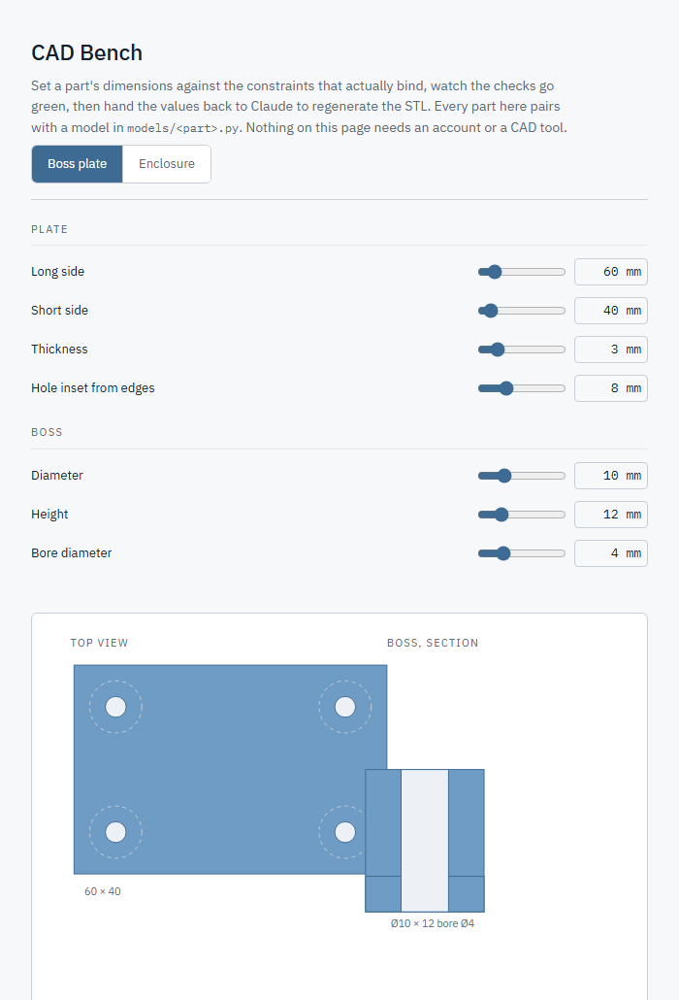
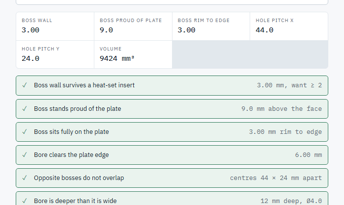
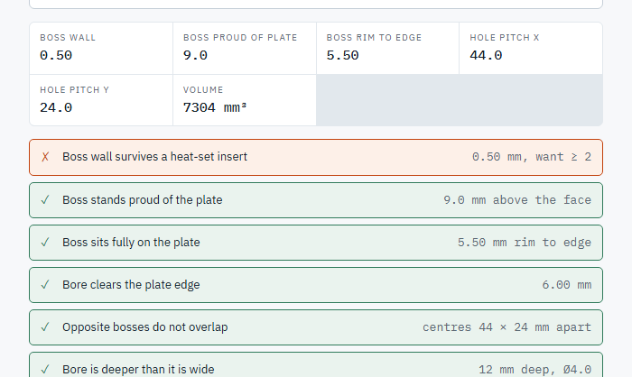
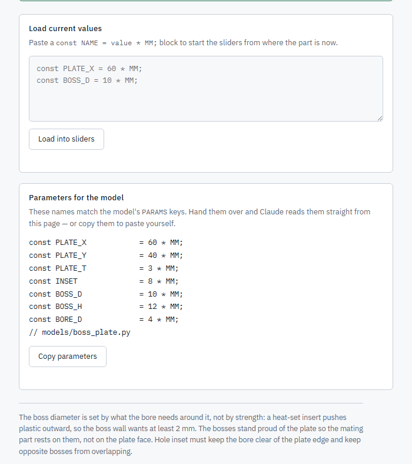
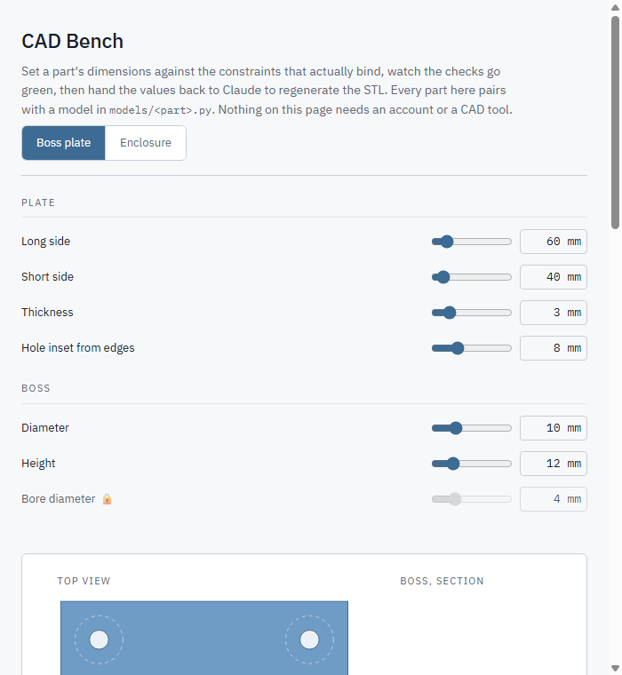

# How to use cad-bench

This is the end-user side of the workflow `SKILL.md` describes to Claude.
You don't run any of the commands below yourself — Claude does — this page
just shows what to expect at each step. Every screenshot below is a real
capture of the skill's own worked example (`models/boss_plate.py`) running
in a browser, not a mockup.

**Jump to:** [ask for a part](#1-ask-for-a-part) ·
[the model](#2-claude-writes-a-parametric-model-not-a-one-off-shape) ·
[the bench page](#3-claude-publishes-a-cad-bench-page--this-is-what-you-see) ·
[the checks](#4-a-row-of-checks-not-a-generic-linter) ·
[handing values back](#5-hand-the-values-back-to-claude) ·
[locked sliders](#6-some-sliders-are-locked-on-purpose) ·
[what it won't do](#what-it-wont-do)

## 1. Ask for a part

You don't need to name the skill or mention CAD tools. Any of these trigger it:

> "make me a mounting plate, four corner bosses for M4 heat-set inserts,
> bore each one, keep the wall around each insert at least 2 mm"

> "I need a bracket for a Pi Zero, rounded corners, wall thickness that
> survives a drop"

> "tweak the enclosure — thinner wall, still passes the checks"

There's a second starting point too: **"here's an STL someone printed, no
source file — make it a parametric part I can tune."** Claude reads the
mesh's own geometry (never by eyeballing a screenshot of it) with
`scripts/inspect_stl.py`, cross-checks anything that mates to a real
component (a motor shaft, a bearing) against that component's own spec, and
builds a proper model from what it finds — see §6 below for what that looks
like on the resulting bench page.

## 2. Claude writes a parametric model, not a one-off shape

Every part is a small Python file against a real B-rep kernel
(`build123d`/OCCT — the same kernel lineage as FreeCAD), not a mesh
approximation. For the corner-boss plate above, that's `models/boss_plate.py`:
a rectangular plate, a cylindrical boss at each corner, each bored, corners
rounded. Running it directly (which Claude does, not you) prints one line on
success:

```
$ python models/boss_plate.py
[boss-plate] OK  watertight  vol=9400.1 mm^3, 0.010% vs exact (kernel)  bbox 60.0x40.0x12.0
  0.23 MB, 4572 tri -> boss_plate.stl
```

That line is a gate, not a progress message. It means: watertight, correctly
wound, the mesh is within 0.010% of the kernel's own exact volume (the gate
is 0.5%), and the bounding box is the size the parameters say it should be.
If any of that were false, **the file would not exist** — a failed check
deletes the STL rather than leaving a wrong part on disk.

## 3. Claude publishes a CAD Bench page — this is what you see

A live page with a slider for every dimension, a preview sketch that
redraws as you move them:



Type a value directly in the box next to a slider instead of dragging, and
it clamps to that slider's own range and snaps to its step — 17.3 mm on a
0.5 mm-step slider lands on 17.5, not 17.3, matching exactly what the slider
itself would have landed on.

## 4. A row of checks, not a generic linter

Below the sketch, the numbers that actually matter for this part — and a
pass/fail row for every physical constraint, in plain language:



Each row is a real constraint, not "is this number positive" — *"does this
wall survive a heat-set insert being melted into it,"* not a generic range
check. Push a value past what the part can actually take and a row turns
red, with the exact number that failed:



(This one is real too: the boss diameter was set to 5 mm against a 4 mm
bore, so the wall left around the insert is only 0.5 mm — the check catches
it and says by how much, not just pass/fail.)

## 5. Hand the values back to Claude

Once every check is green, the bottom of the page has the constants your
sliders landed on, ready to hand off:



Inside the Claude Code app this panel also shows a **"Hand these to
Claude"** button (it needs a small capability the app grants; a plain
browser falls back to **Copy parameters**, shown above). Either way, Claude
reads the values back, writes them to `models/boss_plate.params.json`, and
re-runs the model — same gate, same one-line-on-success report, now with
your numbers instead of the defaults. You get the new STL and a note on
which check had the least margin, since that's where the next change is
most likely to break something.

## 6. Some sliders are locked, on purpose

Not every dimension is a free choice. If a value has to match something
real outside the model — a motor's shaft diameter, a bearing bore, a
fastener standard — dragging it around while tuning everything else is how
a part quietly stops fitting the thing it mates to. Those sliders render
**locked**: dimmed, disabled, a 🔒 next to the label, showing exactly the
number the requirement demands.



(This one's real too: `bore_d` on the boss plate above is fixed to the M4
insert the boss is sized for. Every *other* slider on the page stays free —
locking is for requirements, not for "the default I happened to pick.")

Hover the lock icon for why it's fixed. If the real part on your bench
turns out to measure differently than the spec says, click the 🔒 — it
flips to 🔓 and the slider unlocks for that session, same as any other.

This is also what a part reverse-engineered from an existing STL (§1) tends
to produce: `python scripts/inspect_stl.py part.stl` finds the geometry,
but a dimension that mates to a real component gets locked to that
component's own spec rather than to whatever the loose STL happened to
measure — full method in `references/stl-reverse-engineering.md`.

## What it won't do

Assemblies with mates, thread modelling, sheet-metal unfolding, FEA, or
output formats other than STL/STEP. If a request needs one of those, the
skill says so rather than quietly handing back something that looks right
and isn't.

## For anyone extending the skill itself

If you're editing `SKILL.md`, the models, or the bench template rather than
just using them: `references/verification.md` has the sliver-checking
method and the fudge-factor-tuning discipline this skill's own development
needed the hard way — worth reading before touching a boolean-heavy model.
